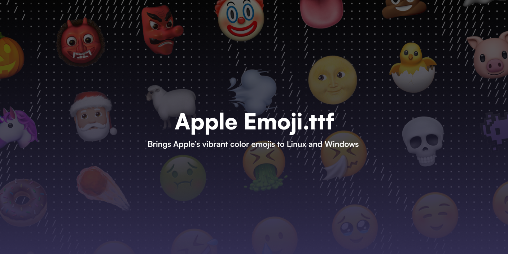

# iOS Emoji for Magisk / KernelSU / APatch

Systemlessly replaces your device's default emoji font with the high-quality iOS Emoji font.

## ✨ 特性 (Features)

- **🎈 永远保持最新 (Always Up-to-Date)**: GitHub Actions 工作流会在每月的 1 号全自动从上游 [samuelngs/apple-emoji-ttf](https://github.com/samuelngs/apple-emoji-ttf) 拉取最新字体并发布新版本，你甚至不需要手动关注更新！
- **🔧 精准处理字体挂载冲突 (Targeted Font Mount Conflict Cleanup)**: 模块现在会仅针对 `NotoColorEmoji.ttf` 扫描其他字体模块；安装时会备份并移除冲突文件，开机时会再次检查，卸载本模块时会把备份恢复回原模块。

---

## 📥 安装 (Installation)

1. 从 [Releases 页面](https://github.com/PianCat/Apple-Emoji-Magisk/releases/latest) 下载最新的 `Apple_Emoji_[版本号].zip` 文件。
2. 打开你的 Root 管理器（Magisk / KernelSU / APatch）。
3. 选择 **模块 (Modules)** → **从本地安装 (Install from storage)**，并选择刚刚下载的 ZIP。
4. **重启设备 (Reboot)**。
5. 享受全新的 iOS Emojis！

如果你的设备上已经安装了其他字体模块，本模块只会处理与 `system/fonts/NotoColorEmoji.ttf` 同名的冲突文件，不会改动那些模块的其他字体资源或 XML 配置。

---

## 🏗️ 开发者相关 (Developers)

这个模块实现了 **零干预自动打包分发闭环 (Zero-Touch CI/CD)**：

- `update_emoji.yml` 工作流每月 1 号执行，检测上游 Emoji 字体 SHA256。
- 如果上游库有新版字体发布，它会自动拉取并**直接修改本仓库内的 `module.prop` 及其配置**，随后推送。
- 代码被修改后，`release.yml` 随即触发，获取新的版本号并将模块排雷打包，自动在仓库创建全新的 GitHub Release 提供给用户进行 OTA 升级。

## 📜 鸣谢 & 许可协议

- **字体资源源头**: [samuelngs/apple-emoji-linux](https://github.com/samuelngs/apple-emoji-linux) (此资源的版权归 Apple Inc. 所有，模块仅作交流学习用途)。
- **模块思路**: [UnicodeFontSet-magisk-module](https://github.com/Losketch/UnicodeFontSet-magisk-module/blob/main/README.md) (感谢 Losketch 提供的字体模块思路和代码参考)。
- **开源协议**: 本项目的自动化打包和分发脚本代码基于 [MIT License](https://github.com/PianCat/Apple-Emoji-Magisk/blob/main/LICENSE) 开源。
